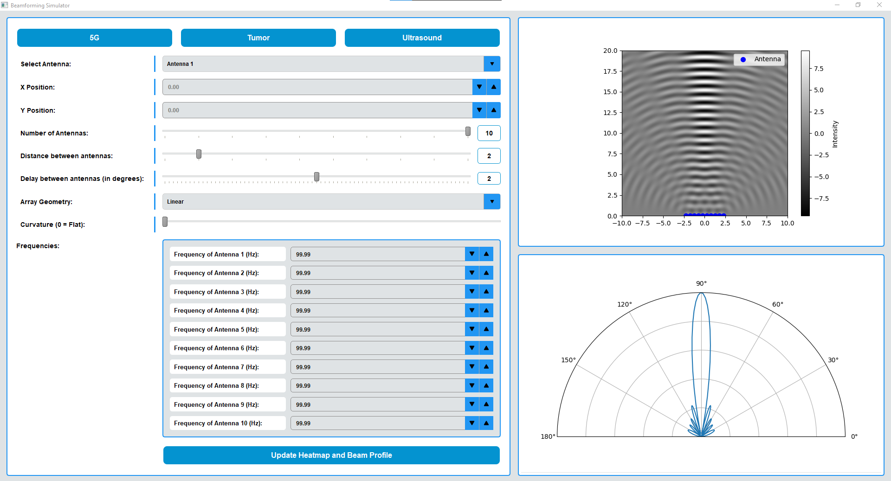

# Beamforming Simulator



This project is a Beamforming Simulator that visualizes the beamforming process using a heatmap and beam profile. The simulator allows users to configure various parameters such as the number of antennas, distance between antennas, delay between antennas, and array geometry.

## Features

- **Heatmap Visualization**: Displays the intensity of the beamforming pattern on a 2D grid.
- **Beam Profile Visualization**: Shows the beam pattern on a polar plot.
- **Antenna Configuration**: 
  - Adjust the number of antennas.
  - Set the distance between antennas.
  - Configure the delay between antennas in degrees.
  - Select the array geometry (Linear or Curved).
  - Adjust the curvature for curved arrays.
- **Frequency Configuration**: 
  - Set a global frequency for all antennas.
  - Adjust individual frequencies for each antenna.
- **Position Configuration**: 
  - Manually adjust the x and y positions of each antenna.
- **Predefined Scenarios**: Load predefined scenarios from JSON files for 5G, Tumor Ablation, and Ultrasound applications.
- **Dynamic Updates**: Real-time updates of the heatmap and beam profile as parameters are adjusted.

## Requirements

- Python 
- PyQt5
- Matplotlib
- NumPy

## Installation

1. Clone the repository:
    ```sh
    git clone <repository-url>
    cd <repository-directory>
    ```

2. Install the required packages:
    ```sh
    pip install -r requirements.txt
    ```

## Usage

1. Run the main script:
    ```sh
    python main.py
    ```

2. Use the GUI to configure the beamforming parameters and visualize the results.

## License

This project is licensed under the MIT License. See the LICENSE file for details.